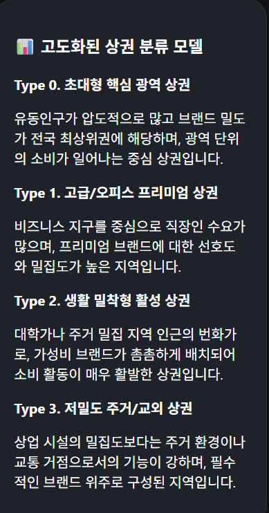
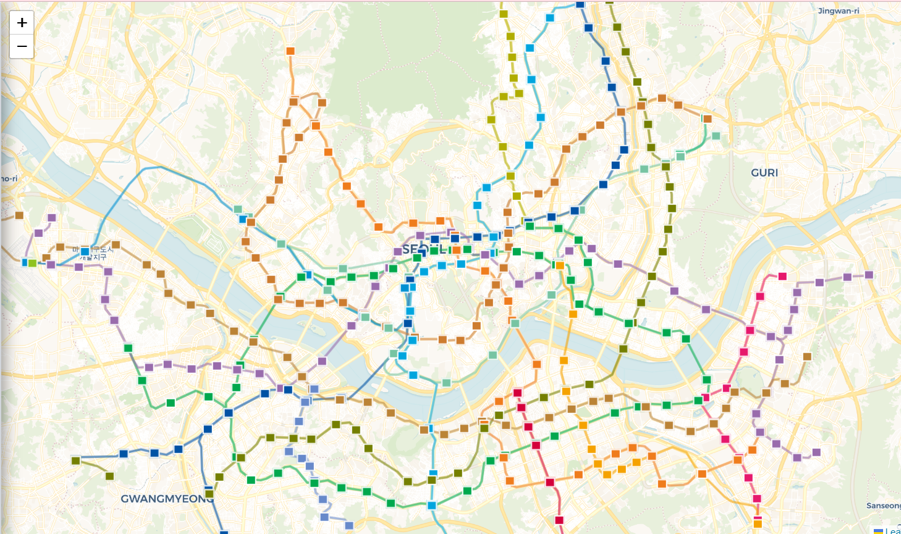
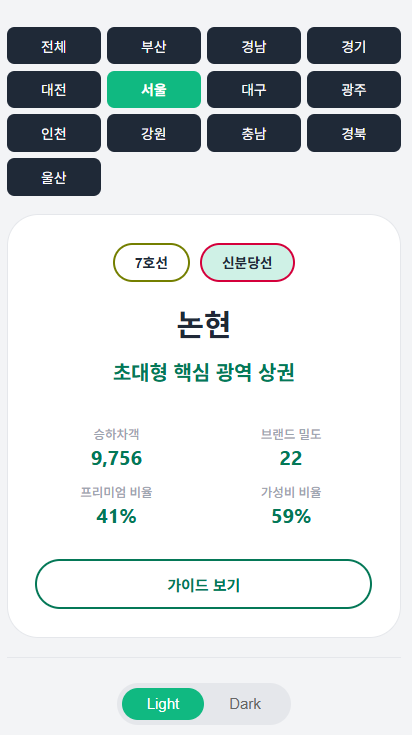

# 전국 전철역 역세권 상권 분석

> 전국 전철역별로 하버-사인 공식을 이용하여 전방 500m의 15개의 프랜차이즈 카페 중 어떤 지점이 있는지 파악하여 주변 상권의 성격을 분석하는 개인프로젝트

- 15개의 커피 프랜차이즈점

> **가성비 프랜차이즈:** 이디야, 메가커피, 빽다방, 컴포즈커피, 더벤티, 메머드커피, 던킨도너츠, 하삼동커피

> **프리미엄 프랜차이즈:** 스타벅스, 투썸플레이스, 폴바셋, 할리스, 파스쿠찌, 공차, 디저트39

## 구현 앱을 통해 볼 수 있는 정보

### 1. 4개의 군집에 대한 정보


- type0 : 유동인구와 브랜드 밀도가 k-means로 클러스터링 된 값보다 높은 경우
- type1 : 프리미엄비율 > 가성비비율(단, 프리미엄_비율 > 45%)
- type2 : 가성비비율 < 프리미엄비율(단, 브랜드_밀도 > 5)
- type3: 그 어떤 경우에도 해당되지 않는 경우

### 2. 전철역별 상권 성격 확인
* 다음 네모버튼을 눌러 역별 상세값을 확인할 수 있다.
* 지역별로 전철역을 전부 확인할 수 있다.



**역별 군집의 특징**

- **승하차객:** 2026년 1월 기준 평균 승하차이용객수
- **프리미엄비율:** 역 주변 500m상권 중 프리미엄 프랜차이즈가 차지하는 비율
- **가성비비율:** 역 주변 500m상권 중 가성비 프랜차이즈가 차지하는 비율
- **브랜드밀도:** 역 주변 500m상권 중 커피 체인점의 갯수



### 3. 전철역별 500m 반경 프랜차이즈점 확인


**기능 구현**
- **브랜드 상세 분석:** 15개의 프랜차이즈 지점중 하나를 클릭하면 전철역 기준 반경 500m에 어떤 프랜차이즈 지점이 있나 확인이 가능하다.
- 노선별로 어떤 전철역이 있나 볼 수 있다.
- 역을 클릭하면 반경 500m에서 브랜드 입점 역 반경 500m의 브랜드 체인점을 다 볼 수 있다.

### 4. 데이터 수집 과정
- 커피 프랜차이즈 15지점은 각 프랜차이즈 공식사이트에 들어가서 데이터를 수집
- 전철역 데이터는 공공 데이터 포털을 통해 데이터 수집
- 커피 체인점에 대한 정보는 MySQL
- 전철역 데이터는 (backend/전체_역사정보_최종_정제_v58.csv)

### 5. 디렉토리 구조
```
subway_archive/
├── backend/                          # Flask 기반 백엔드 서버
│   ├── app.py                        # 프로덕션 Flask 애플리케이션 (MySQL 연동 및 CSV파일 연동)
│   ├── 전체_역사정보_최종_정제_v58.csv                        # 전철역 리스트(출처 : 공공 데이터 포탈)

│
├── frontend/                         # React 기반 프론트엔드
│   ├── src/
│   │   ├── App.js                    # 메인 라우팅 및 상태 관리
│   │   ├── BrandAnalyzer.js            # 커피 브랜드별 전철역 간의 거리 파악
│   │   ├── bridgeWaypoints.js           # 전철 노선도 세부화
│   │   ├── constant.js                   # 전철역 노선 색깔 및 클러스터링 값 관리
│   │   └── ... (CSS 및 컴포넌트)
│   ├── public/
│   ├── concurrently
│   ├── frontend@0.1.0
│   ├── package-lock.json
│   └── package.json
│
└── requirements.txt                  # Python 의존성 패키지
```

## 6. 기술 스택 (Tech Stack)  
### Backend (Python 3.8+)  

| 라이브러리 | 용도 | 비고 |
| :--- | :--- | :--- |
| **sklearn** | AI 모델 | |
| **NumPy** | 벡터 연산 | |
| **Pandas** | 마스터 데이터 처리 | |
| **KMeans** | 상권 성격 클러스터링 | |
| **StandardScaler** | 전철역 데이터 스케일링 | |
| **Flask** | REST API 서버 지원 | |
| **SQLAlchemy** | DB 연결 엔진 |  |
| **math** | 역과 카페간의 거리 계산 | |

### Frontend (Node.js 16+ / React)  

| 라이브러리 | 용도 | 비고 |
| :--- | :--- | :--- |
| **React 19** | UI 라이브러리 | Hooks, State 관리 |
| **Axios** | HTTP 클라이언트 | API 통신 |
| **React Scripts** | 빌드 도구 | Create React App |
| **Concurrently** | 개발 도구 | Front/Back 동시 실행 |
| **leaflet** | 라이브러리 | 지도 구현 |

